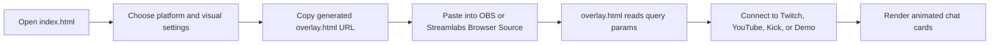
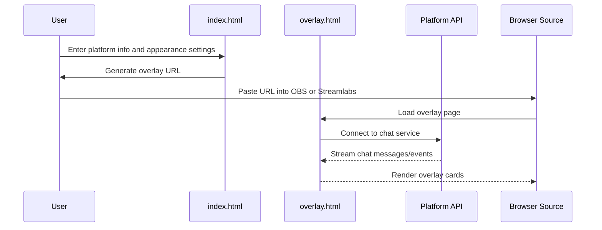

# Chat Overlay

StreamChat Overlay is a static browser-source overlay for live chat from Twitch, YouTube, and Kick.
It is designed to be opened directly in OBS, Streamlabs, or any browser source that supports a hosted HTML page.

The repository is intentionally small:

- `index.html` is the setup and URL builder.
- `overlay.html` is the live overlay that renders messages.
- There is no backend, build step, or package manager dependency.

## What it does

This project turns live chat feeds into an animated, stream-ready overlay. It supports:

- Twitch chat through IRC WebSocket.
- YouTube live chat through the YouTube Data API v3.
- Kick chat through Kick's public WebSocket endpoint.
- Theme, animation, font size, placement, message limit, and message lifetime controls.
- Avatar/logo fallback support for platforms that do not provide profile images reliably.
- Badges for common roles such as broadcaster, moderator, subscriber, VIP, partner, and platform-specific membership markers.
- Demo mode for previewing the overlay without connecting to a live chat.

## How It Works

The setup page builds a browser-source URL with query parameters. That URL points at `overlay.html`, which reads the parameters and connects to the requested platform(s).



## Repository Layout

| File | Purpose |
| --- | --- |
| `index.html` | Setup UI, URL generation, host instructions, preview and demo launchers. |
| `overlay.html` | Runtime overlay that connects to chat sources and renders message cards. |

## Quick Start

1. Open `index.html` in a browser.
2. Fill in at least one supported platform source.
3. Tune the visual settings as needed.
4. Copy the generated browser-source URL.
5. Paste that URL into OBS, Streamlabs, or another browser source.

If you want a fast preview without a live platform connection, use Demo Mode.

## Platform Support

### Twitch

Twitch uses anonymous IRC over WebSocket.

What the overlay reads:

- Channel name.
- Chat messages.
- Twitch badges.
- Twitch emotes via the rendered emote IDs.
- Some event messages such as subscriptions, resubs, raids, gift subs, and bits.

No Twitch API key is required.

### YouTube

YouTube uses the YouTube Data API v3.

What the overlay reads:

- Live video ID.
- API key.
- Chat messages from the active live chat.
- Author profile image when available.
- Broadcaster, moderator, and channel-member style indicators.
- Super Chat and membership-style event cards when the API exposes those payloads.

You must provide both the API key and the live video ID.

### Kick

Kick uses a public channel lookup plus WebSocket chat subscription.

What the overlay reads:

- Kick channel username.
- Chat messages.
- Profile image when available.
- Broadcaster, moderator, and subscriber-style markers.
- Follow, sub, gift, raid, and membership-style events when detected from the payload.

No Kick API key is required.

## URL Parameters

The generated browser-source URL points at `overlay.html` with one or more query parameters.

| Parameter | Example | Meaning |
| --- | --- | --- |
| `twitch` | `ninja` | Twitch channel username. |
| `yt_key` | `AIza...` | YouTube Data API v3 key. |
| `yt_vid` | `dQw4w9WgXcQ` | YouTube live video ID. |
| `kick` | `xqc` | Kick channel username. |
| `avatar` | `https://.../logo.png` | Fallback avatar or brand image URL. |
| `theme` | `neon` | Visual theme name. |
| `anim` | `slide` | Entry animation style. |
| `pos` | `right` | Overlay side, `right` or `left`. |
| `size` | `14` | Font size in pixels. |
| `dur` | `25` | Message lifetime in seconds. |
| `max` | `20` | Maximum visible messages. |
| `status` | `0` | Hides the connection status indicator when set to `0`. |
| `demo` | `1` | Runs demo mode instead of connecting to a platform. |

You can also open `overlay.html` directly and pass parameters manually.

## Visual Controls

The overlay includes several presentation options:

- Themes: `neon`, `fire`, `ocean`, `rose`, `glass`, `minimal`, `cyber`, `sunset`, and `mono`.
- Animations: `slide`, `pop`, `fade`, `float`, and `zoom`.
- Positioning: `right` or `left`.
- Font size: 11px to 22px in the setup UI.
- Message lifetime: 5 to 120 seconds in the setup UI.
- Visible message limit: 5 to 50 in the setup UI.

## OBS and Streamlabs Setup

The setup page already includes the same basic workflow:

1. Host the files somewhere public.
2. Copy the generated `overlay.html` URL.
3. Add a Browser Source in OBS or Streamlabs.
4. Paste the URL.
5. Set the size you want, then confirm.

Recommended starting point:

- Width: `400`
- Height: `800`

If your scene background does not stay transparent, add this custom CSS in the browser source:

```css
body { background: transparent !important; }
```

## Hosting Options

The setup UI suggests several static hosting choices:

- GitHub Pages.
- Netlify Drop.
- Vercel.
- Cloudflare Pages.

Because the project is static, any host that serves HTML files over HTTPS will work.

## Local Testing

You can test locally by opening `index.html` and using the generated preview URL, but some platform integrations may require hosting because of browser security and cross-origin behavior.

For demo-only testing, use the demo mode button or open `overlay.html?demo=1` with your preferred visual settings.

## Known Limitations

- YouTube chat requires a valid API key and a currently active live video.
- Twitch and Kick connections depend on external services and may reconnect if those services close the connection.
- Message and event support depends on what each platform sends in the payload.
- This repository does not include a backend, persistence layer, moderation, or chat logging.

## Implementation Notes

The overlay script is organized around a few core responsibilities:

- URL parameter parsing.
- Source connection state tracking.
- Message queueing and batching.
- Message rendering.
- Per-platform transport handling.
- Expiration and cleanup.

That structure keeps the runtime self-contained and makes the overlay easy to host anywhere.

## Practical Workflow



## Suggested Usage Pattern

1. Start with Demo Mode to confirm layout.
2. Pick one platform and verify messages appear.
3. Add a fallback avatar if your platform image coverage is inconsistent.
4. Reduce message duration or max messages if the overlay gets crowded.
5. Switch to another theme or animation if you want a different stream style.

## File Reference

- [index.html](index.html)
- [overlay.html](overlay.html)
