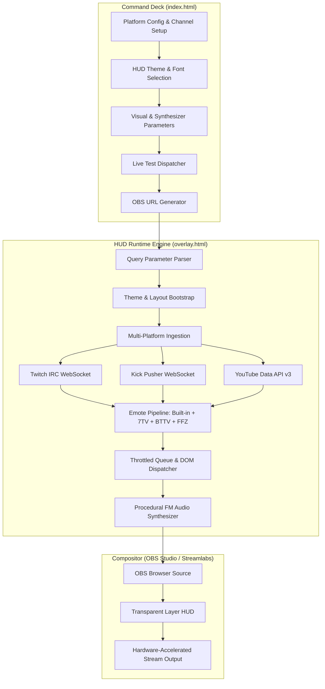
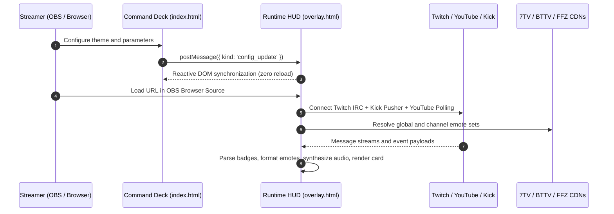

# StreamChat Overlay

High-performance, zero-dependency stream chat HUD engine engineered for OBS Studio, Streamlabs, and browser sources. Supports simultaneous multi-platform ingestion across Twitch, YouTube Live, and Kick with hardware-accelerated rendering and procedural Web Audio synthesis.

```
Twitch IRC WS  ─┐
Kick Pusher WS ─┼─> HUD Engine (overlay.html) ──> OBS Browser Source
YouTube API v3 ─┘
```

---

## System Architecture





---

## Key Capabilities

- **Zero Runtime Dependencies:** Built strictly with vanilla Web Standards (HTML5, CSS3, ES2022 JavaScript, Web Audio API, WebSockets). No Node.js runtime, npm packages, or build pipelines required.
- **Simultaneous Multi-Platform Ingestion:** Connects concurrently to Twitch (Anonymous IRC WebSocket), YouTube Live (Data API v3 polling), and Kick (Pusher WebSocket) into a unified, synchronized HUD stream.
- **Emote Engine & CDN Resolution:** 40+ built-in fallback emote mappings with verified 200 OK CDN endpoints plus asynchronous fetching for 7TV v3, BetterTTV, and FrankerFaceZ channel and global sets.
- **BigEmote Auto-Scaling:** Messages consisting solely of 1 to 3 emotes automatically scale to 1.8x height.
- **10 HUD Design Presets:** Built-in modular themes with custom clip paths, font pairings, and CSS variable styling.
- **Hardware-Accelerated Compositing:** 60fps CSS transitions (Glitch, Slide, Pop, Fade, Float, Zoom) utilizing `transform` and `opacity` with layout containment and strict memory limits.
- **Multi-Tier Event Alerts:** Visual formatting for Subscriptions, Resubs, Gift Subscriptions, Raids, Bits, YouTube Memberships, and color-tiered YouTube SuperChats.
- **Procedural FM Audio Synthesizer:** 6 synthesized audio profiles generated in real time via the Web Audio API with automatic `AudioContext` state resumption in OBS Studio.
- **Interactive Control Deck:** Full configuration GUI in `index.html` with real-time `postMessage` synchronization, stream test deck, and LocalStorage persistence.

---

## HUD Theme Matrix

| Theme ID | Design Aesthetic | Primary Accent | Secondary Accent |
|---|---|---|---|
| `neon` | Cyberpunk / Neo-Tokyo with scanline contrast | `#00f0ff` | `#ff007f` |
| `valorant` | Tactical Sci-Fi with 45-degree chamfers and killfeed styling | `#ff4655` | `#ece8e1` |
| `stealth` | OLED Minimal monochrome (Shroud / Tarik style) | `#ffffff` | `#a1a1aa` |
| `fire` | Magma / Apex Champion molten glow | `#ff3700` | `#ffaa00` |
| `cyber` | Phosphor green terminal with dashed border styling | `#00ff66` | `#00f0ff` |
| `synthwave` | Outrun 80s horizon gradient | `#f43f5e` | `#fbbf24` |
| `glass` | Frosted glassmorphism with 24px backdrop blur | `#ffffff` | `#94a3b8` |
| `rose` | Sakura soft aesthetic with rounded pill geometry | `#fb7185` | `#f43f5e` |
| `ocean` | Arcane / Deep Abyssal rune blue gradient | `#0ea5e9` | `#14b8a6` |
| `floating` | 0% background opacity with high-contrast text contour | `#ffffff` | `#00f0ff` |

*Theme aliases (`cyberpunk`, `tactical`, `minimal`, `magma`, `matrix`, `sunset`, `frost`, `kawaii`, `hextech`, `pure`) are mapped automatically.*

---

## Configuration & URL Query Parameter Specification

Parameters can be passed directly to `overlay.html` via URL query parameters or configured interactively using `index.html`.

### Platform Connection Parameters

| Parameter | Type | Default | Example | Description |
|---|---|---|---|---|
| `twitch` | `string` | `""` | `shroud` | Twitch channel username (anonymous IRC WebSocket). |
| `yt_key` | `string` | `""` | `AIzaSy...` | Google Cloud API key with YouTube Data API v3 enabled. |
| `yt_vid` | `string` | `""` | `dQw4w9WgXcQ` | Active YouTube live broadcast video ID. |
| `kick` | `string` | `""` | `xqc` | Kick channel username. |
| `kick_id` | `string` | `""` | `123456` | Direct numeric Kick chatroom ID. |
| `avatar` | `string` | `""` | `https://...` | Custom streamer fallback avatar image URL. |

### Visual & Layout Parameters

| Parameter | Type | Default | Example | Description |
|---|---|---|---|---|
| `theme` | `string` | `neon` | `valorant` | Active HUD theme preset identifier. |
| `font` | `string` | `""` | `chakra` | Typography override (`rajdhani`, `chakra`, `orbitron`, `space-mono`, `inter`, `press-start`). |
| `opacity` | `number` | `90` | `0` | Card background opacity percentage (`0` = pure floating text, `100` = solid card). |
| `stroke` | `0 \| 1` | `0` | `1` | Enables high-contrast black text outline for readability over bright video. |
| `anim` | `string` | `glitch` | `slide` | Entrance animation (`glitch`, `slide`, `pop`, `fade`, `float`, `zoom`). |
| `pos` | `string` | `right` | `left` | Screen dock anchor (`right`, `left`, `top-right`, `top-left`). |
| `dir` | `up \| down` | `up` | `down` | Message flow order (`up` = bottom-up stack, `down` = top-down list). |
| `size` | `number` | `14` | `16` | Base font size in pixels. |
| `emote_size` | `number` | `26` | `32` | Standard emote render height in pixels. |
| `dur` | `number` | `25` | `0` | Message lifetime in seconds before dismissal (`0` = permanent log). |
| `max` | `number` | `20` | `15` | Maximum concurrent messages retained in the DOM. |
| `avatars` | `0 \| 1` | `1` | `0` | Toggle profile avatar visibility. |
| `badges` | `0 \| 1` | `1` | `0` | Toggle moderator, subscriber, and VIP badge icons. |
| `time` | `0 \| 1` | `0` | `1` | Toggle `[HH:MM]` timestamps on messages. |
| `status` | `0 \| 1` | `0` | `1` | Toggle connection status indicator in top corner. |

### Audio & Moderation Parameters

| Parameter | Type | Default | Example | Description |
|---|---|---|---|---|
| `sound` | `0 \| 1` | `1` | `0` | Enable procedural sound synthesis on incoming messages and events. |
| `sound_profile` | `string` | `cyber` | `ping` | FM synthesis profile (`cyber`, `coin`, `chime`, `ping`, `pop`, `mute`). |
| `volume` | `number` | `0.45` | `0.7` | Master synthesizer volume (`0.0` to `1.0`). |
| `highlight` | `string` | `""` | `myhandle` | Username target for golden illuminated mention borders. |
| `filter` | `string` | `""` | `word1,word2` | Comma-separated list of terms to suppress from the feed. |
| `accent` | `hex` | `""` | `00f0ff` | Custom primary accent color (hex without `#`). |
| `accent2` | `hex` | `""` | `ff007f` | Custom secondary accent color (hex without `#`). |
| `demo` | `0 \| 1` | `0` | `1` | Runs simulated chat messages and events for staging. |

---

## OBS Studio / Streamlabs Integration

```
1. Open index.html in a web browser and configure your platforms and visual settings.
2. Select an OBS resolution preset:
   - Sidebar:    420 x 850
   - Bottom Bar: 850 x 250
   - Compact:    320 x 500
   - Fullscreen: 1920 x 1080
3. Copy the generated URL from Card [07].
4. In OBS Studio: Sources Panel -> Add (+) -> Browser.
5. Set Name: "Stream Chat Overlay".
6. Paste the URL into the "URL" field.
7. Set Width and Height to match the chosen resolution preset.
8. Uncheck "Shutdown source when not visible" (maintains active WebSockets across scene transitions).
9. Check "Control audio via OBS" if you wish to route synthesized alert audio into OBS audio tracks.
10. Click OK.
```

---

## Deployment Targets

Because the codebase consists solely of static assets, it can be hosted on any static web server or CDN:

- **GitHub Pages:** Repository Settings -> Pages -> Source: Deploy from branch `main` / `root`.
- **Cloudflare Pages:** Connect Git repository -> Framework preset: None -> Build output directory: `/`.
- **Vercel / Netlify:** Import repository directly with zero build configuration.
- **Local File / Offline:** Open `index.html` or point OBS Browser Source directly to `file:///path/to/overlay.html`.

---

## Custom CSS Extension API

You can inject stylesheet overrides using the `?custom_css=` query parameter (URL encoded) or within the Custom CSS playground in `index.html`.

### Monospace Code Block Style

```css
.msg {
  font-family: 'Space Mono', monospace !important;
  letter-spacing: -0.02em;
}
```

### High-Intensity Custom Border Glow

```css
.msg {
  box-shadow: 0 0 16px rgba(0, 240, 255, 0.4) !important;
}
```

### Gradient Text Username

```css
.username {
  background: linear-gradient(135deg, #00f0ff, #ff007f);
  -webkit-background-clip: text;
  -webkit-text-fill-color: transparent;
}
```

---

## License

MIT License. Open-source and free for all streamers and developers.
